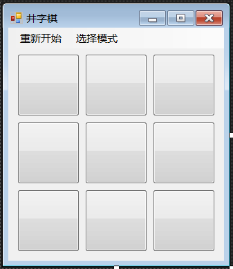
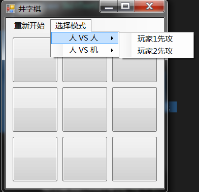
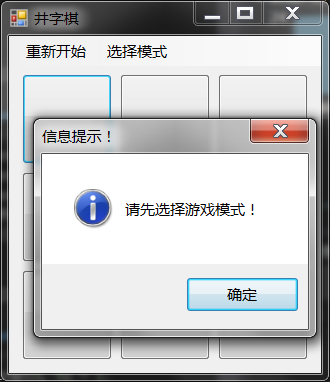
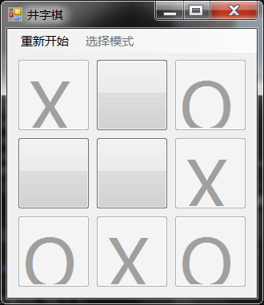
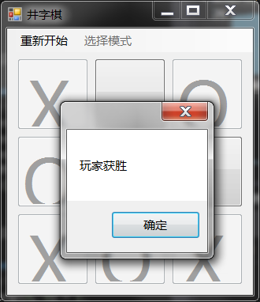
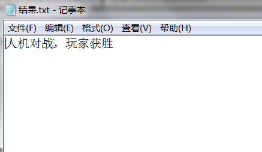

# **题目五：井字棋**
## **一、题目要求**  
编程实现一个井字棋小游戏并满足以下要求：
1. 可由用户选择玩家或者电脑先手；
2. 可将每局对结果保存至文件；
3. 有良好的人机交互界面；
4. 可以设计附加功能；
---
## **二、程序设计**
### 1.创建游戏窗口

### 2.初始数据设置与模式选择
```c
//模式表示（1 人VS人且玩家1先攻,2 人VS人且玩家2先攻,3 人VS电脑且人先攻,4 人VS电脑且电脑先攻）
public int GameType = 0;//取1,2,3,4值
//表示两种类型的棋子，ture表示玩家1的棋子，false表示玩
public bool turn = true;
//初始化按钮数组，0-未按下，1-“X”（玩家），2-"O"（电脑）
public int[,] ButtonArray = { { 0, 0, 0 }, { 0, 0, 0 }, { 0, 0, 0 } };

public Form()
{
    InitializeComponent();
}
//以下为 模式选择时的初始化
public void 玩家1ToolStripMenuItem_Click(object sender, EventArgs e)
{
    GameType = 1;//1 人VS人且玩家1先攻
    模式ToolStripMenuItem.Enabled = false;
    turn = true;
}

public void 玩家2ToolStripMenuItem_Click(object sender, EventArgs e)
{
    GameType = 2;//2 人VS人且玩家2先攻
    模式ToolStripMenuItem.Enabled = false;
    turn = false;
}

public void 人ToolStripMenuItem_Click(object sender, EventArgs e)
{
    GameType = 3;//3 人VS电脑且人先攻
    模式ToolStripMenuItem.Enabled = false;
}

public void 电脑ToolStripMenuItem_Click(object sender, EventArgs e)
{
    GameType = 4;//4 人VS电脑且电脑先攻
    模式ToolStripMenuItem.Enabled = false;
//ComputerTurn();//简单固定位置起步

//电脑随机下第一颗棋子
    Random ro = new Random();
    int x = ro.Next(1, 10);
    switch (x)
    {
        case 1: Turn(2, 0, 0); break;
        case 2: Turn(2, 0, 1); break;
        case 3: Turn(2, 0, 2); break;
        case 4: Turn(2, 1, 0); break;
        case 5: Turn(2, 1, 1); break;
        case 6: Turn(2, 1, 2); break;
        case 7: Turn(2, 2, 0); break;
        case 8: Turn(2, 2, 1); break;
        case 9: Turn(2, 2, 2); break;
        default: MessageBox.Show("Error!", "信息提示！", MessageBoxButtons.OK, MessageBoxIcon.Error); break;
    }
}
```
### 3.设置按键
```c
private void Button_Click(object sender, EventArgs e)
        {
            //首先得选择游戏模式
            if (GameType == 0)
            {
                MessageBox.Show("请先选择游戏模式！", "信息提示！", MessageBoxButtons.OK, MessageBoxIcon.Information);
                return;
            }
            #region 获取被点击按钮及其Name、X、Y坐标
            Button ClickedButton = (Button)sender;
            string ClickedButtonName = ClickedButton.Name;
            //根据按钮的名字来分析出当前所点击处是哪一行那一列的格子
            int ClickedButtonX = Convert.ToInt32(ClickedButtonName.Substring(6, 1));
            int ClickedButtonY = Convert.ToInt32(ClickedButtonName.Substring(7, 1));
            #endregion
            //若为人机模式
            if(GameType==3||GameType==4)Turn(1, ClickedButtonX, ClickedButtonY);
            //人和人对战模式
            else if (turn==true)
            {
                Turn(1, ClickedButtonX, ClickedButtonY);
            }
            else if (turn == false)
            {
                Turn(2, ClickedButtonX, ClickedButtonY);
            }
            turn = !turn;//换棋子
        }
```
### 4.下棋顺序
```c
     public void Turn(int Player, int X, int Y)
        {
            string Graph;
            if (Player == 1) Graph = "X";
            else Graph = "O";

            //修改对应按钮数组中对应位置
            ButtonArray[X, Y] = Player;

            //将被点击按钮上的文字改为“X”
            ((Button)Controls.Find("Button" + X + Y, true)[0]).Text = Graph;

            //将被点击按钮禁用
            ((Button)Controls.Find("Button" + X + Y, true)[0]).Enabled = false;

            //判断是否获胜
            if (JudgeWin(Player) == 0)
                if (Player == 1 && (GameType == 3 || GameType == 4)) ComputerTurn();//人机模式自动让机器下棋
        }

        //电脑下子
        public void ComputerTurn()
        {
            #region 调用寻找缺口的函数
            //寻找电脑的缺口
            int Result = FindBreach(1);

            //未找到电脑的缺口，寻找玩家的缺口
            if (Result == 0) Result = FindBreach(2);
            #endregion
            //找是否有条件更好的四个角落位置
            if (Result == 0) Result = FindBreach2(1);

            #region 未找到玩家的缺口，随便寻找四角是否被占
            if (Result == 0)
                if (ButtonArray[0, 0] == 0) Turn(2, 0, 0);
                else if (ButtonArray[0, 2] == 0) Turn(2, 0, 2);
                else if (ButtonArray[2, 0] == 0) Turn(2, 2, 0);
                else if (ButtonArray[2, 2] == 0) Turn(2, 2, 2);
                //寻找中心是否被占
                else if (ButtonArray[1, 1] == 0) Turn(2, 1, 1);
                //寻找是否有空位
                else if (ButtonArray[0, 1] == 0) Turn(2, 0, 1);
                else if (ButtonArray[1, 0] == 0) Turn(2, 1, 0);
                else if (ButtonArray[1, 2] == 0) Turn(2, 1, 2);
                else if (ButtonArray[2, 1] == 0) Turn(2, 2, 1);
            #endregion
        }

```
### 5.电脑智能算法
```c
        /// <summary>
        /// 寻找缺口，寻找是否有一条线上已经有两个同样的棋子，并补上第三个，用于防止对方连成一条线或者使自己连成一条线
        /// </summary>
        /// <param name="Player">玩家为1，电脑为2</param>
        /// <returns></returns>
        public int FindBreach(int Player)
        {
            int Result = 0, Opponent = 0;

            #region 分配自己和对手的Player值
            if (Player == 1) Opponent = 2;
            else Opponent = 1;
            #endregion

            #region 判断并执行缺口
            //判断第i(i=1,2,3)横排
            for (int i = 0; i < 3; i++)
            {
                if (ButtonArray[i, 0] + ButtonArray[i, 1] + ButtonArray[i, 2] == 2 * Opponent &&
                    ButtonArray[i, 0] != Player && ButtonArray[i, 1] != Player && ButtonArray[i, 2] != Player)
                {
                    //寻找该排是否有空位
                    if (ButtonArray[i, 0] == 0)
                    {
                        Turn(2, i, 0);
                        return Result = 1;
                    }
                    else if (ButtonArray[i, 1] == 0)
                    {
                        Turn(2, i, 1);
                        return Result = 1;
                    }
                    else if (ButtonArray[i, 2] == 0)
                    {
                        Turn(2, i, 2);
                        return Result = 1;
                    }
                }
            }

            //判断第i(i=1,2,3)纵排
            for (int i = 0; i < 3; i++)
            {
                
                if (ButtonArray[0, i] + ButtonArray[1, i] + ButtonArray[2, i] == 2 * Opponent &&
                        ButtonArray[0, i] != Player && ButtonArray[1, i] != Player && ButtonArray[2, i] != Player)
                {
                    if (ButtonArray[0, i] == 0)
                    {
                        Turn(2, 0, i);
                        return Result = 1;
                    }
                    else if (ButtonArray[1, i] == 0)
                    {
                        Turn(2, 1, i);
                        return Result = 1;
                    }
                    else if (ButtonArray[2, i] == 0)
                    {
                        Turn(2, 2, i);
                        return Result = 1;
                    }
                }
            }

            //判断左上到右下
            if (ButtonArray[0, 0] + ButtonArray[1, 1] + ButtonArray[2, 2] == 2 * Opponent &&
                     ButtonArray[0, 0] != Player && ButtonArray[1, 1] != Player && ButtonArray[2, 2] != Player)
            {
                if (ButtonArray[0, 0] == 0)
                {
                    Turn(2, 0, 0);
                    return Result = 1;
                }
                else if (ButtonArray[1, 1] == 0)
                {
                    Turn(2, 1, 1);
                    return Result = 1;
                }
                else if (ButtonArray[2, 2] == 0)
                {
                    Turn(2, 2, 2);
                    return Result = 1;
                }
            }

            //判断右上到左下
           if (ButtonArray[0, 2] + ButtonArray[1, 1] + ButtonArray[2, 0] == 2 * Opponent &&
                     ButtonArray[0, 2] != Player && ButtonArray[1, 1] != Player && ButtonArray[2, 0] != Player)
            {
                if (ButtonArray[0, 2] == 0)
                {
                    Turn(2, 0, 2);
                    return Result = 1;
                }
                else if (ButtonArray[1, 1] == 0)
                {
                    Turn(2, 1, 1);
                    return Result = 1;
                }
                else if (ButtonArray[2, 0] == 0)
                {
                    Turn(2, 2, 0);
                    return Result = 1;
                }
            }
            #endregion

            return Result;
        }

        //判断是否有 创造两个一排的良好机会
        public int FindBreach2(int Player)
        {
            int Result = 0, Opponent = 0;

            #region 分配自己和对手的Player值
            if (Player == 1) Opponent = 2;
            else Opponent = 1;
            #endregion
            //判断第横排
            for (int j = 0; j < 2; j++ )
            {
                int i = 2 * j;
                if (ButtonArray[i, 0] + ButtonArray[i, 1] + ButtonArray[i, 2] == Opponent &&
                    ButtonArray[i, 0] != Player && ButtonArray[i, 1] != Player && ButtonArray[i, 2] != Player)
                    if (ButtonArray[i, 0] == Opponent)
                    {
                        Turn(2, i, 2);
                        return Result = 1;
                    }
                    else if (ButtonArray[i, 2] == Opponent)
                    {
                        Turn(2, i, 0);
                        return Result = 1;
                    }
            }
            //判断纵排
            for (int j = 0; j < 2; j++)
            {
                int i = 2 * j;
                if (ButtonArray[0, i] + ButtonArray[1, i] + ButtonArray[2, i] == Opponent &&
                ButtonArray[0, i] != Player && ButtonArray[1, i] != Player && ButtonArray[2, i] != Player)
                    if (ButtonArray[0, i] == Opponent)
                    {
                        Turn(2, 2, i);
                        return Result = 1;
                    }
                    else if (ButtonArray[2, i] == Opponent)
                    {
                        Turn(2, 0, i);
                        return Result = 1;
                    }
            }

            //判断对角
            for (int j = 0; j < 2; j++)
            {
                int i = 2 * j;
                if (ButtonArray[0, i] + ButtonArray[1, 1] + ButtonArray[2, 2 - i] == Opponent &&
                ButtonArray[0, 0] != Player && ButtonArray[1, 1] != Player && ButtonArray[2, 2] != Player)
                    if (ButtonArray[0, i] == Opponent)
                    {
                        Turn(2, 2, 2-i);
                        return Result = 1;
                    }
                    else if (ButtonArray[2, 2-i] == Opponent)
                    {
                        Turn(2, 0, i);
                        return Result = 1;
                    }
            }
            
            return Result;
        }

        //判断游戏是否已经分出胜负
        public int JudgeWin(int Player)
        {
            int Result = 0;

            #region 进行判断
            //判断第i(i=1,2,3)横排
            for (int i = 0; i < 3; i++)
            {
                if (ButtonArray[i, 0] == Player && ButtonArray[i, 1] == Player && ButtonArray[i, 2] == Player)
                    Result = Player;
            }

            //判断第i(i=1,2,3)纵排
            for (int i = 0; i < 3; i++)
            {
                if (ButtonArray[0, i] == Player && ButtonArray[1, i] == Player && ButtonArray[2, i] == Player)
                    Result = Player;
            }

            //判断左上到右下
            if (ButtonArray[0, 0] == Player && ButtonArray[1, 1] == Player && ButtonArray[2, 2] == Player)
                Result = Player;

            //判断右上到左下
            if (ButtonArray[0, 2] == Player && ButtonArray[1, 1] == Player && ButtonArray[2, 0] == Player)
                Result = Player;
            #endregion

            #region 报出结果
            if (Result == 1)//棋子 在数组中表示值为1的一方胜利
            {
                if (GameType == 3 || GameType == 4)
                {
                    MessageBox.Show("玩家获胜"); SaveResult("人机对战，玩家获胜\r\n");//人机模式
                }//人机模式
                else
                {
                    MessageBox.Show("玩家1获胜"); SaveResult("人人对战，玩家1获胜\r\n");//人对战人
                }
                Restart();
                return 1;
            }
            if (Result == 2)//棋子 在数组中表示值为2的一方胜利
            {
                if (GameType == 3 || GameType == 4)
                {
                    MessageBox.Show("电脑获胜"); SaveResult("人机对战，电脑获胜\r\n");//人机模式
                }
                else
                {
                    MessageBox.Show("玩家2获胜"); SaveResult("人人对战，玩家2获胜\r\n");//人对战人
                }
                Restart();
                return 2;
            }
            #endregion
            //判断是否下满棋盘
            #region 格子已满，打成平局
            bool full = true;
            foreach (int item in ButtonArray)
            {
                if (item == 0) full = false;//在数组中站位值为0，说明此处没有棋子
            }
            if (full)
            {
                MessageBox.Show("平局");
                SaveResult("平局\r\n");
                Restart();
            }
            #endregion
            //如果没有获胜的结果，返回0
            return 0;
        }

```
### 7.测试程序
```c
[TestMethod]
        public void Man_vs_Comp_ManWin()
        {
            Form myFrom = new Form();
            myFrom.GameType = 3;
            myFrom.ButtonArray[0, 0] = 1;
            myFrom.ButtonArray[0, 1] = 1;
            myFrom.ButtonArray[0, 2] = 1;
            var result = myFrom.JudgeWin(1);
            Assert.AreEqual(1, result);
        }
```
## **三、程序运行**
### 1.选择模式
  
点击“选择模式”按钮，在其中选择游戏模式以开始游戏。若未选择模式直接开始游戏，则会跳出弹窗提示玩家选择游戏  

### 2.游戏进行
  
游戏进行情况如上图所示，只需点击相应的方框便可进行下子操作。并且已下子的位置不会重复下子。
### 3.游戏结果
  
游戏有函数判断输赢，达到结束条件时会跳出弹窗显示游戏结果。同时也能将游戏的结果以TXT文本的形式保存在指定路径，效果如下图所示。


## **四、项目分工**
代码编写：李睿康、周兆伟、李越、张仕博、陈达
代码手册生成：张仕博
XML注释：李越
readme撰写：周兆伟
单元测试撰写：李睿康