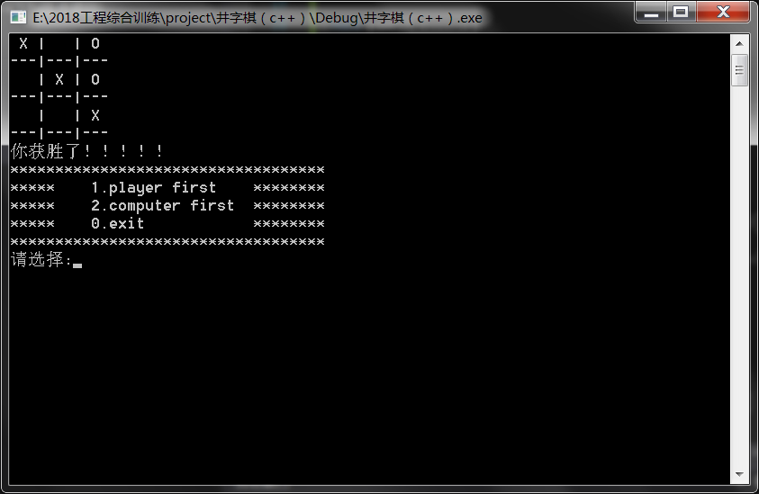

# **题目5的程序**  
## *题目要求*  
编程实现一个井字棋小游戏并满足以下要求：
1. 可由用户选择玩家或者电脑先手；
2. 可将每局对结果保存至文件；
3. 有良好的人机交互界面；
4. 可以设计附加 功能。  
## *程序解读*
### 头文件编写  
```c++
#ifndef __SZQ_GAME_H__
#define __SZQ_GAME_H__
#define ROWS 3
#define COLS 3


void init_board(char board[ROWS][COLS], int rows, int cols);
void print_board(char board[ROWS][COLS], int rows, int cols);
void play_game(char board[ROWS][COLS], int input);
char check_win(char board[ROWS][COLS]);
void player_move(char board[ROWS][COLS]);
void com_move(char board[ROWS][COLS]);

#endif 
```
定义变量并申明调用函数。  
### 函数编写  
#### 1.目录函数  
```c++
void menu()
{
	printf("***********************************\n");
	printf("*****    1.player first    ********\n");
	printf("*****    2.computer first  ********\n");
	printf("*****    0.exit            ********\n");
	printf("***********************************\n");

}
```
显示初始界面，让玩家选择游戏模式。
#### 2.游戏运行函数  
```c++
void game()
{
	int input = 1;
	char board[ROWS][COLS] = { 0 };
	init_board(board, ROWS, COLS);
	while (input)
	{
		menu();
		printf("请选择:");
		scanf("%d", &input);
		if (input == 1 || input == 2)
		{
			init_board(board, ROWS, COLS);
			print_board(board, ROWS, COLS);
			play_game(board, input);
		}

	}
}
```
综合调用其他函数，使游戏初始化并能反复运行。
#### 3.棋盘函数  
```c++
void init_board(char board[ROWS][COLS], int rows, int cols)
{
	int i = 0;
	int j = 0;
	for (i = 0; i < rows; i++)
	{
		for (j = 0; j < cols; j++)
		{
			board[i][j] = ' ';
		}
	}
}

void print_board(char board[ROWS][COLS], int rows, int cols)
{
	int i = 0;
	system("cls");
	for (i = 0; i < ROWS; i++)
	{
		printf(" %c | %c | %c \n", board[i][0], board[i][1], board[i][2]);
		printf("---|---|---\n");
	}
}

```
这部分包含了两个函数：init-board 用于初始化棋盘，即把棋盘清空。 print-board可将棋盘边界与棋盘中的棋子打印出来。
#### 4.下棋函数  
```c++
void com_move(char board[ROWS][COLS])
{
	int x = 0;
	int y = 0;
	srand((unsigned)time(NULL));
	while (1)
	{
		x = rand() % 3;
		y = rand() % 3;
		if (board[x][y] == ' ')
		{
			board[x][y] = 'O';
			return;
		}
	}

}

void player_move(char board[ROWS][COLS])
{
	int x = 0;
	int y = 0;
	while (1)
	{
		printf("请输入坐标：");
		scanf("%d%d", &x, &y);
		if (board[x - 1][y - 1] == ' ')
		{
			board[x - 1][y - 1] = 'X';
			return;
		}
		else
		{
			printf("输入错误");
		}
	}

}
```
下棋部分包括玩家下棋与电脑下棋。玩家下棋中具备报错功能，能提醒玩家将棋子下在正确的区域。电脑下棋采用的是随机落子的方法，不够智能有待改进。
#### 5.判断函数  
```c++
char check_win(char board[ROWS][COLS])
{
	int i = 0;
	for (i = 0; i < 3; i++)
	{
		if ((board[i][0] == board[i][1]) && (board[i][1] == board[i][2]) && (board[i][1] != ' '))
		{
			return 'p';
		}
	}
	for (i = 0; i < 3; i++)
	{
		if ((board[0][i] == board[1][i]) && (board[1][i] == board[2][i]) && (board[1][i] != ' '))
		{
			return 'p';
		}
	}
	if ((board[0][0] == board[1][1]) && (board[1][1] == board[2][2]) && (board[1][1] != ' '))
	{
		return 'p';
	}
	if ((board[0][2] == board[1][1]) && (board[1][1] == board[2][0]) && (board[1][1] != ' '))
	{
		return 'p';
	}
}
```
判断游戏是否达到结束的条件。
#### 6.棋序与结束函数  
```c++
void play_game(char board[ROWS][COLS], int input)
{
	char ret;
	int count = 0;
	while (1)
	{
		if (input== 1)
		{
			if (count >= 9)
			{
				printf("平局！！！！\n");
				break;
			}
			player_move(board);
			count++;
			print_board(board, ROWS, COLS);
			if ((ret = check_win(board)) == 'p')
			{
				printf("你获胜了！！！！！\n");
				break;
			}
			if (count >= 9)
			{
				printf("平局！！！！\n");
				break;
			}
			count++;
			printf("电脑走：\n");
			com_move(board);

			print_board(board, ROWS, COLS);
			if ((ret = check_win(board)) == 'p')
			{
				printf("呵呵！！！\n");
				break;
			}
		}
		else
		{
			if (count >= 9)
			{
				printf("平局！！！！\n");
				break;
			}
			count++;
			printf("电脑走：\n");
			com_move(board);

			print_board(board, ROWS, COLS);
			if ((ret = check_win(board)) == 'p')
			{
				printf("呵呵！！！\n");
				break;
			}
			if (count >= 9)
			{
				printf("平局！！！！\n");
				break;
			}
			player_move(board);
			count++;
			print_board(board, ROWS, COLS);
			if ((ret = check_win(board)) == 'p')
			{
				printf("你获胜了！！！！！\n");
				break;
			}
		}

	}

}
```
根据选择决定先后手，并根据判断函数结果可结束游戏。  
### 主函数
```c++
int main()
{

	game();
	return 0;
}

```
## 结果预览  
